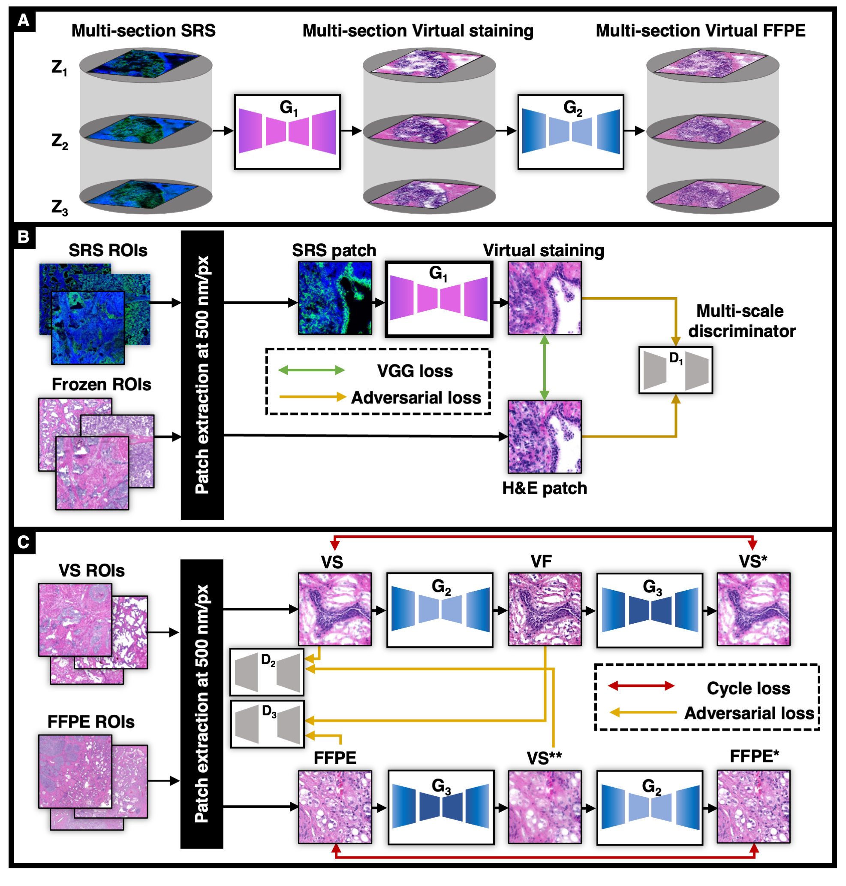

# SRS_virtual_staining



We are excited to present our deep learning framework that enables the conversion of SRS images of frozen prostate samples into conventional histology images through a process we call virtual staining. Our framework involves two models. The first one translates the SRS data into virtual staining of frozen images, while the second model utilizes a cycle-GAN approach to convert virtual stain images into FFPE-looking images that are more common in pathology.

## Requirements
- This source has been tested on Ubuntu 18.04.4 and macOS Big Sur
- CPU or NVIDIA GPU (for training, we recommend having a >10GB GPU)
- Python 3.7.1 
- CUDA 10.1
- PyTorch 1.3

## Python Dependencies
- numpy
- scipy
- torch
- torchvision
- sys
- PIL

## Training

- The training dataset is available upon reasonable request. 
- To train the virtual stain model, please use this command:
```bash
python train.py --n_epochs [numberof epochs] --dataset_dir [directory of the dataset] --batch_size [batch size] --lr [learning rate] 
```

## Virtual FFPE

Please refer to this [repository](https://github.com/kiakh93/Virtual_FFPE) for more information.

### Results


